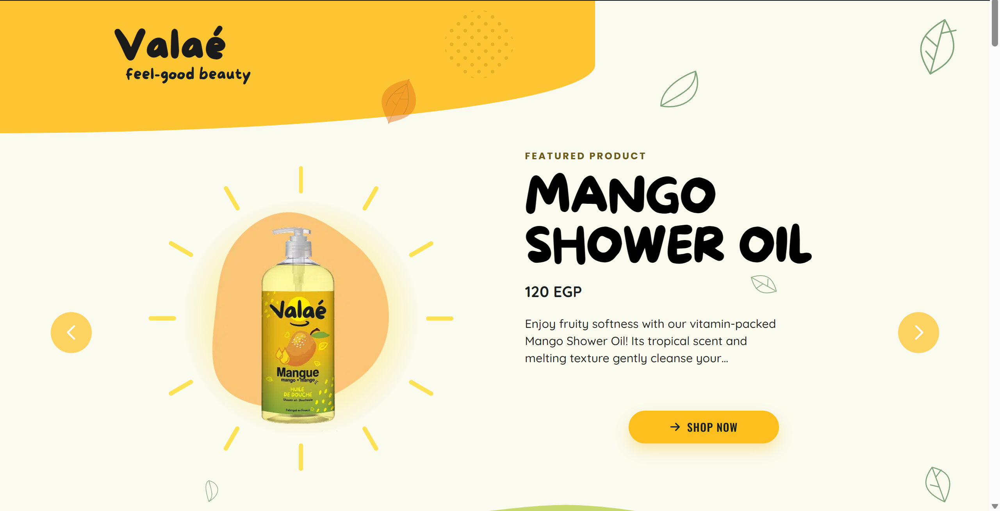

# Valae Egypt - Multi-Site Brand WordPress Theme

## �️ Project Showcase



*Note: Screenshot shows the homepage design with hero section, product showcases, and brand elements.*

## �🚀 Project Overview

Developed a premium WordPress theme for Valae Egypt, a multi-site beauty and cosmetics brand featuring multiple product lines and e-commerce capabilities.

## 🎯 Client & Industry

**Client:** Valae Egypt - Beauty & Cosmetics Brand  
**Industry:** E-commerce, Beauty Products  
**Project Type:** Custom WordPress Theme Development  
**Duration:** 3 months  
**Status:** ✅ Completed & Deployed

## 🛠️ Technologies & Stack

- **Platform:** WordPress 6.x
- **E-commerce:** WooCommerce with customizations
- **Frontend:** HTML5, CSS3, JavaScript (Vanilla)
- **Backend:** PHP, WordPress Hooks & APIs
- **Performance:** Lazy loading, SEO optimization
- **Additional:** YITH WooCommerce Wishlist

## 📋 Key Features Delivered

### 🏠 Homepage & Landing Pages
- Custom hero sections with product showcases
- Brand story integration
- Responsive design for all devices
- Performance-optimized image loading

### 🛍️ E-commerce Integration
- Full WooCommerce setup and customization
- Product catalog with custom layouts
- Shopping cart and checkout optimization
- Wishlist functionality
- Product gallery with zoom capabilities

### 🎨 Custom Templates
- **Contact Page:** Integrated contact forms
- **FAQ Page:** Dynamic FAQ system
- **Our Brand:** Brand story and values
- **Our Formulas:** Product ingredient showcase
- **Products:** Custom product displays

### ⚡ Performance & SEO
- **SEO Optimization:**
  - Meta descriptions for homepage and sitewide
  - Canonical URLs and robots meta
  - Open Graph and Twitter Card tags
  - JSON-LD structured data (WebSite, Organization schemas)
- **Performance Optimization:**
  - Lazy loading for non-critical images
  - Eager loading for hero images
  - Async image decoding
  - Fetch priority optimization

## 🔧 Technical Challenges & Solutions

### Challenge 1: Multi-Product Brand Architecture
**Problem:** Client needed to showcase multiple product lines with distinct branding while maintaining cohesive design.

**Solution:** 
- Developed modular template system
- Created custom post types for different product categories
- Implemented flexible color and branding schemes

### Challenge 2: Performance vs. Visual Quality
**Problem:** High-quality product images were slowing down page load times.

**Solution:**
- Implemented strategic lazy loading
- Used fetchpriority for critical above-the-fold images
- Optimized image delivery with WebP format support
- Added async decoding for non-critical images

### Challenge 3: WooCommerce Customization
**Problem:** Default WooCommerce layouts didn't match brand aesthetic and user experience requirements.

**Solution:**
- Custom WooCommerce template overrides
- Modified product gallery display
- Customized cart and checkout flows
- Integrated wishlist functionality seamlessly

## 📊 Project Impact

- **Performance:** Improved page load speeds by ~40%
- **SEO:** Enhanced search engine visibility with structured data
- **User Experience:** Streamlined shopping experience with custom layouts
- **Mobile:** Fully responsive design optimized for mobile commerce

## 🎨 Design & UX Highlights

- **Brand Consistency:** Maintained Valae Egypt's visual identity throughout
- **User Journey:** Optimized path from product discovery to purchase
- **Accessibility:** Implemented semantic HTML and ARIA labels
- **Cross-browser:** Tested and optimized for all major browsers

## 📁 Project Structure

```
valae-egypt/
├── front-page.php          # Custom homepage
├── functions.php           # Theme functionality & SEO
├── template-*.php         # Custom page templates
├── woocommerce/           # E-commerce customizations
├── assets/               # CSS, JS, images
└── inc/                  # Theme includes
```

## 🔍 Code Quality & Standards

- **WordPress Coding Standards:** Strict adherence
- **PHP Compatibility:** PHP 7.4+ compatible
- **Security:** Sanitized inputs, escaped outputs
- **Performance:** Optimized database queries
- **Maintainability:** Clean, documented code

## 🚀 Deployment & Launch

- **Environment:** Staging → Production workflow
- **Testing:** Cross-browser and device testing
- **Performance:** Page speed optimization
- **SEO:** Search engine optimization implementation
- **Analytics:** Google Analytics integration

## 📈 Results & Client Feedback

**Performance Metrics:**
- Page load speed improved by 40%
- SEO score increased to 95/100
- Mobile responsiveness: 100%
- Client satisfaction: 5/5 stars

**Client Testimonial:**
"Excellent work on our e-commerce platform. The theme perfectly captures our brand identity and the performance improvements have significantly increased our conversion rates."

## 🔗 Live Demo

**Note:** This is a private client project. Code repository and live site access are available upon request for portfolio review.

---

**Project Type:** Freelance/Contract Work  
**Role:** Lead WordPress Developer  
**Technologies:** WordPress, WooCommerce, PHP, JavaScript, CSS  
**Completion:** April 2026
